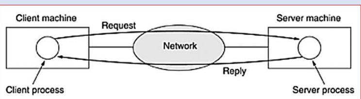
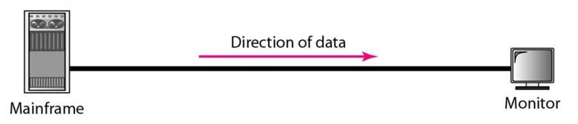
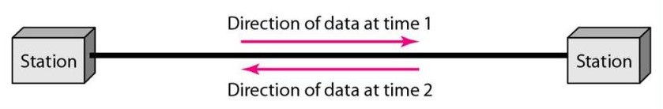
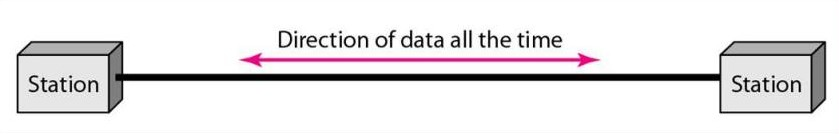

# Network

- Computer network is a collection of autonomous computers interconnected by a single technology.
- Two computers are said to be interconnected if they are able to exchange information.
- The connection need not be via a copper wire; fiber optics, microwaves, infrared, and communication satellites can also be used.
- Networks come in many sizes, shapes and forms.
- The Internet is not a single network but a network of networks and the Web is a distributed system that runs on top of the Internet.

## Uses of Computer Networks

### Business Applications

- Resource sharing - a group of office workers share a common printer
- Client-server model - two processes are involved, one on the client machine and one on the server machine. Communication takes the form of the client process sending a message over the network to the server process. The client process then waits for a reply message. When the server process gets the request, it performs the requested work or looks up the requested data and sends back a reply.

- e-mail
- Videoconferencing
- e-commerce (electronic commerce)

### Home Applications

- Access to remote information
- Person-to-person communication
- Interactive entertainment (Online Games)
- Electronic commerce

### Mobile Users

- Mobile computers, such as notebook computers and personal digital assistants (PDAs)
- Wireless networks
- Mobile computing

### Social Issues

- New social, ethical, and political problems
- Anonymous messages

## Data Flow

Communication between two devices can be simplex, half-duplex, or full-duplex

### Simplex

- Communication is unidirectional
- Only one of the two devices on a link can transmit; the other can only receive
- Eg: Keyboards and traditional monitors
- The simplex mode can use the entire capacity of the channel to send data in one direction.

### Half-Duplex

- Each station can both transmit and receive, but not at the same time
- When one device is sending, the other can only receive, and vice versa
- Eg: Walkie-talkies and CB (citizens band) radios

### Full-Duplex

- Both stations can transmit and receive simultaneously
- Signals going in one direction share the capacity of the link
- This sharing can occur in two ways:
  - Either the link must contain two physically separate transmission paths, one for sending and the other for receiving
  - Or the capacity of the channel is divided between signals traveling in both directions.
- Eg: telephone network.
- The full-duplex mode is used when communication in both directions is required all the time
- The capacity of the channel, however, must be divided between the two directions.

