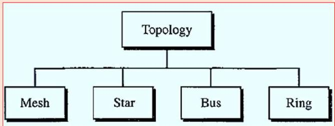

# Network Hardware

Two criterion for classifying networks are

1. Transmission technology
2. Scale

## Classification by Transmission Technology

There are two types of transmission technology

### Broadcast links

- Broadcast networks have a single communication channel that is shared by all the machines on the network.
- Short messages, called packets, sent by any machine are received by all the others.
- An address field within the packet specifies the intended recipient. Upon receiving a packet, a machine checks the address field.
- If the packet is intended for the receiving machine, that machine processes the packet; if the packet is intended for some other machine, it is just ignored.
- Broadcast systems generally also allow the possibility of addressing a packet to all destinations by using a special code in the address
  field.
- When a packet with this code is transmitted, it is received and processed by every machine on the network. This mode of operation is called broadcasting.
- Some broadcast systems also support transmission to a subset of the machines, something known as multicasting.
- One possible scheme is to reserve one bit to indicate multicasting.
  The remaining n - 1 address bits can hold a group number.. When a packet is sent to a certain group, it is delivered to all machines subscribing to that group

### Point-to-point links

- A point-to-point connection provides a dedicated link between two devices. The entire capacity of the link is reserved for transmission between those two devices.
- When you change television channels by infrared remote control, you are establishing a point-to-point connection
- Smaller, geographically localized networks tend to use broadcasting, whereas larger networks usually are point-to-point.
- Point-to-point transmission with one sender and one receiver is sometimes called unicasting.

## Classification by Scale (Physical Size of Network)

<table>
    <tr>
        <td>Interprocessor distance</td>
        <td>Processors located in same</td>
        <td>Example</td>
    </tr>
    <tr>
        <td>1m</td>
        <td>Square meter</td>
        <td>Personal Area Network</td>
    </tr>
    <tr>
        <td>10m</td>
        <td>Room</td>
        <td rowspan="3">Local Area Network</td>
    </tr>
    <tr>
        <td>100m</td>
        <td>Building</td>
    </tr>
    <tr>
        <td>1km</td>
        <td>Campus</td>
    </tr>
    <tr>
        <td>10km</td>
        <td>City</td>
        <td>Metropolitan Area Network</td>
    </tr>
    <tr>
        <td>100km</td>
        <td>Country</td>
        <td rowspan="2">Wide Area Network</td>
    </tr>
    <tr>
        <td>1000km</td>
        <td>Continent</td>
    </tr>
    <tr>
        <td>10000km</td>
        <td>Planet</td>
        <td>The Internet</td>
    </tr>
</table>

### Local Area Networks (LAN)

- Privately-owned networks within a single building or campus of up to a few kilometers in size.
- They are widely used to connect personal computers and workstations in company offices and factories to share resources (e.g., printers) and exchange information.
- LANs are distinguished from other kinds of networks by three characteristics:

  a. size
  b. Their transmission technology
  c. Their topology.

- LANs are restricted in size
- LANs may use a transmission technology consisting of a cable to which all the machines are attached, like the telephone lines used in rural areas

#### Topologies

##### Mesh Topology

Every device has a dedicated point-to-point link to every other device. The term dedicated means that the link carries traffic only between the two devices it connects.

To find the number of physical links in a fully connected mesh network with n nodes

<!-- todo math -->

$$
n(n-1)/2
$$

Advantages:

- Eliminating the traffic problems - the use of dedicated links guarantees that each connection can carry its own data load
- Mesh topology is robust - If one link becomes unusable, it does not incapacitate the entire system
- Privacy or security - When every message travels along a dedicated line, only the intended recipient sees it.

Disadvantages:

- The main disadvantages of a mesh are related to the amount of cabling and the number of I/O ports required

Example:

connection of telephone regional offices

##### Star Topology

each device has a dedicated point-to-point link only to a central controller, usually called a hub.

- The devices are not directly linked to one another
- The controller (hub) acts as an exchange: If one device wants to send data to another, it sends the data to the controller, which then relays the data to the other connected device

Advantages:

- Less expensive than a mesh topology.
- Easy to install and reconfigure.
- Less cabling needs to be housed,
- Robustness - If one link fails, only that link is affected. All other links remain active
- Easy fault identification

Disadvantages:

If the hub goes down, the whole system is dead

Example:

High-speed LANs often use a star topology with a central hub

##### Bus Topology

A bus topology is multipoint. One long cable acts as a backbone to link all the devices in a network.

Nodes are connected to the bus cable by drop lines and taps.

Advantages:

- Ease of installation
- Bus uses less cabling than mesh or star topologies

Disadvantages:

- Difficult reconnection and fault isolation.
- Difficult to add new devices
- A fault or break in the bus cable stops all transmission

Example:

Ethernet LANs can use a bus topology

##### Ring Topology

each device has a dedicated point-to-point connection with only the two devices on either side of it.

A signal is passed along the ring in one direction, from device to device, until it reaches its destination. Each device in the ring incorporates a repeater. Repeater regenerates the bits and passes them.

Advantages:

- Easy to install and reconfigure
- To add or delete a device requires changing only two connections

Disadvantages:

- Unidirectional traffic
- A break in the ring can disable the entire network

##### Hybrid Topology

we can have a main star topology with each branch connecting several stations in a bus topology

### Metropolitan Area Networks (MAN)

- A metropolitan area network, or MAN, covers a city.
- Example of a MAN is the cable television network available in many cities
- Another example of a MAN is the part of the telephone company network that can provide a high-speed DSL line to the customer

### Wide Area Network (wAN)

- A wide area network, or wAn, spans a large geographical area, often a country or continent
- The switched wAN connects the end systems, which usually comprise a router that connects to another LAN or WAN
- The point-to-point WAN is normally a line leased from a telephone or cable TV provider that connects a home computer or a small LAN to an Internet service provider (IsP).
- This type of wAN is often used to provide Internet access.
