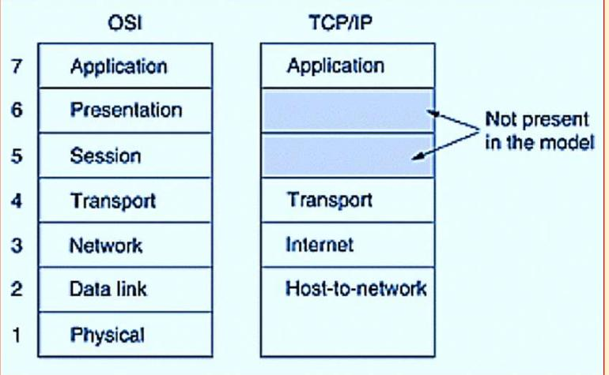
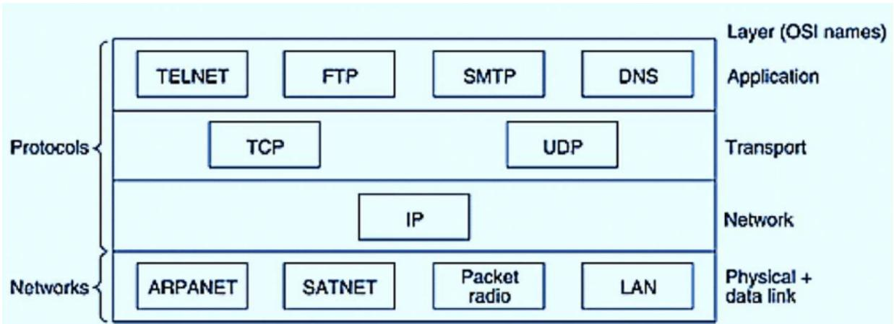

# TCP/IP Protocol Suite

- It is the Internet Protocol Suite
- The set of communication protocols used for the internet and other similar networks
- Viewed as a set of layers
- Each layer solves a set of problems involving the transmission of data and provides well defined services to the upper layers
- Consists of 4 layers:
  1. Link layer
  2. Internet layer
  3. Transport layer
  4. Application layer

## Application layer

This is the place where high level protocols reside and those protocols include FTP, SMTP, DNS, SNMP and HTTP.

- File Transfer Protocol(FTP) : To permit reliable transfer of files between different platforms. It uses TCP at the transport layer.
- Hyper Text Transfer Protocol(HTTP): Permits applications such as browsers to upload and download web pages. To check reliability, it makes use of TCP at the transport layer. HTTP delivers HTML documents
- Simple Mail Transfer Protocol (sMTP) : Helps to send email to other computers that support TCP/IP protocol suite.
- Domain Name System(DNS) Protocol: Allows the network determine the IP address from name and vice versa
- Simple Network Management Protocol (SNMP) : For the transport of network management information
- Telnet Protocol: This is the virtual terminal protocol which allows the user in one machine to log into another machine and work

## Transport Layer

- The transport layer is responsible for the transport of data
- Transport layer communicates data between two applications running on computers, making use of port numbers
- It also incorporates error detection
- TCP(Transmission Control Protocol): It is a reliable connection oriented protocol that permits a byte stream originating on machine to be transported without error to any machine in the internet.
- UDP(User Datagram Protocol) : It is an unreliable connectionless protocol for applications that do not want TCP's sequencing on flow control.

## Internet Layer

- This layer is responsible for sending packets through different networks
- The internet layer encapsulates the segments from the Transport Layer into envelopes called packets and then determines the path the information is to take across the network
- IP(Internet Protocol): Responsible for delivering packets from source to destination by looking at the IP addresses
- ARP(address Resolution Protocol): Used to find Ethernet(hardware) address from a specific IP address

## Link Layer or Network Access Layer

- The link layer offers the ability to access the physical network to transmit data
- Breaks down the packets from the Internet layer into frames and then eventually into bits for transmission across the physical network medium
- Contains all specifications relating to the transmission of data over a physical network
- Routing and synchronizing data over a network, checking data formats, converting signals and error detection in the transmitted data
- Signaling and network medium standards such as Ethernet, Token ring, FDDI, X.25,Frame Relay, Point-to-Point Protocol(PPP), RS 232 etc. are defined in this layer
- Network Interface Cards, hubs, repeaters, switches etc. operate at this layer

