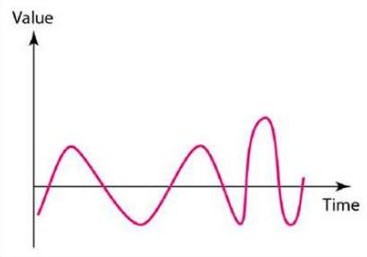
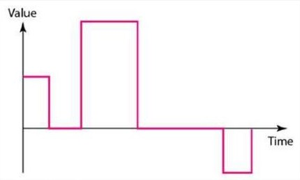
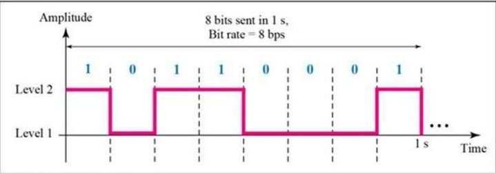
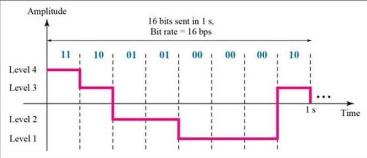

# Physical Layer

One major task of Physical Layer is to provide services for the data link layer.

- The data in the data link layer consists of Os and 1s organized into frames that are ready to be sent across the transmission medium.
- This stream of Os and 1s must first be converted into signals.
- One of the services provided by the physical layer is to create a signal that represents this stream of bits.
- The transmission medium must be controlled by the physical layer.

## Analog and Digital Data

- To be transmitted, data must be transformed to electromagnetic signals
- Both data and the signals that represent them can be either analog or digital in form.
- The term analog data refers to information that is continuous.
- For example, an analog clock that has hour, minute, and second hands gives information in a continuous form; the movements of the hands are continuous
- digital data refers to information that has discrete states. a digital clock that reports the hours and the minutes will change suddenly from 8:05 to 8:06.
- Digital data take on discrete values.
- For example, data are stored in computer memory in the form of Os and 1s. They can be converted to a digital signal or modulated into an analog signal for transmission across a medium.
- Signals can be analog or digital. Analog signals can have an infinite number of values in a range; digital signals can have only a limited number of values.

## Periodic and Non-periodic Signals

- Both analog and digital signals can take one of two forms: periodic or non-periodic.
- A periodic signal completes a pattern within a measurable time frame, called a period, and repeats that pattern over subsequent identical periods. The completion of one full pattern is called a cycle.
- A non-periodic signal changes without exhibiting a pattern or cycle that repeats over time.
- In data communications, we commonly use periodic analog signals and non-periodic digital signals.

## Digital Signals

- A $1$ can be encoded as a positive voltage and a $0$ as zero voltage.
- A digital signal can have more than two levels. In this case, we can send more than 1 bit for each level.
- We send 1 bit per level in part a of the figure and 2 bits per level in part b of the figure.
- In general, if a signal has L levels, each level needs $\log_2 L$ bits

- Bit Rate - The bit rate is the number of bits sent in 1second, expressed in bits per second (bps).
- Bit Length - The bit length is the distance one bit occupies on the transmission medium.

Bit length $=$ propagation speed x bit duration
