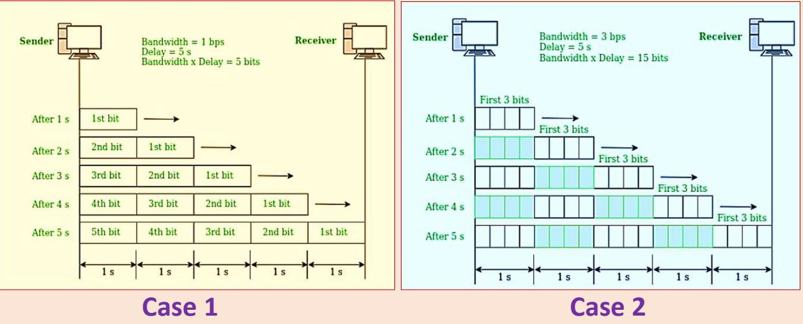

# Network Performance

## Bandwidth

Bandwidth is the data carrying capacity of the network/transmission medium. Bandwidth is usually measured in bits transferred per second (bps) through a path or link.

### bandwidth in hertz

It is the range of frequencies in a composite signal or the range of frequencies that a channel can pass.

### bandwidth in bits per second

It is the speed of bit transmission in a channel or link.

## Throughput

- The throughput is a measure of how fast we can actually send data through a network.
- Practical measure of the amount of data actually transmitted through a channel.
- It depends on the latency.

## Latency (Delay)

The latency or delay defines how long it takes for an entire message to completely arrive at the destination from the time the first bit is sent out from the source.

Latency $=$ propagation time $^ +$ transmission time $^ +$ queuing time + processing delay

### Propagation Time

Propagation time measures the time required for a bit to travel from the source to the destination.

Propagation time $=$ Distance/Propagation speed

### Transmission Time

There is a time between the first bit leaving the sender and the last bit arriving at the receiver.

Transmission time $=$ Message size /Bandwidth

### Queuing Time

The time needed for each intermediate or end device to hold the message before it can be processed.

## Bandwidth-Delay Product

The bandwidth-delay product defines the number of bits that can fill the link.

Case 1: Assume a link is of bandwidth 1bps and the delay of the link is 5s. Let us find the bandwidth-delay product in this case. From the image, we can say that this product ${ 1 \times 5 }$ is the maximum number of bits that can fill the link. There can be close to 5 bits at any time on the link.

Case 2: Assume a link is of bandwidth 3bps. From the image, we can say that there can be a maximum of $3 \times 5 = 1 5$ bits on the line. The reason is that, at each second, there are 3 bits on the line and the duration of each bit is 0.33s.

- For both examples, the product of bandwidth and delay is the number of bits that can fill the link.
- It gives the maximum amount of data that can be transmitted by the sender at a given time before waiting for acknowledgment

## Jitter

- Jitter is another performance issue related to delay. In technical terms, jitter is a "packet delay variance".
- It can simply mean that jitter is considered as a problem when different packets of data face different delays in a network and the data at the receiver application is time-sensitive, i.e. audio or video data.
- Jitter is measured in milliseconds(ms).
- It is defined as an interference in the normal order of sending data packets.
