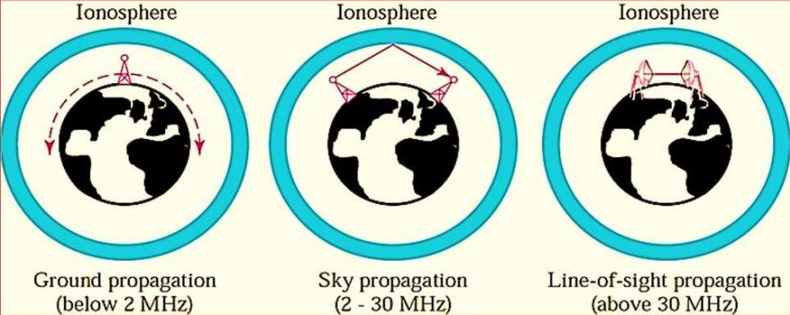
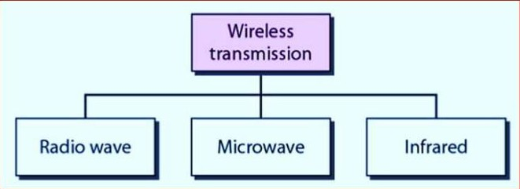
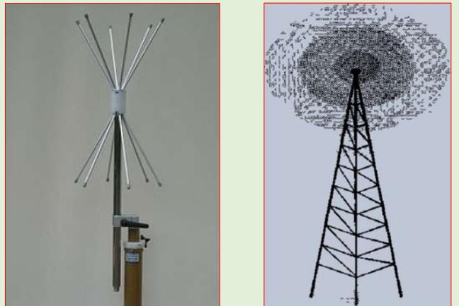
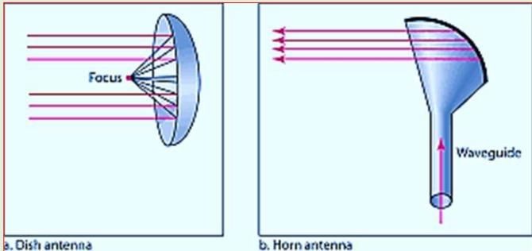
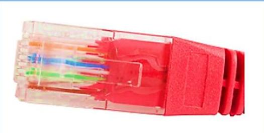
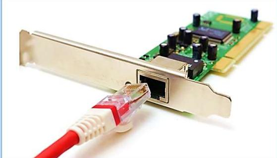
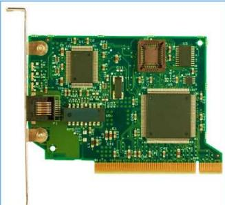

# Unguided Media (Wireless)

- Unguided media transport electromagnetic waves without using a physical conductor.
- This type of communication is often referred to as wireless communication. Signals are normally broadcast through free space and thus are available to anyone who has a device capable of receiving them.
- Unguided signals can travel from the source to destination in several ways: ground propagation, sky propagation, and line-ofsight propagation

## Ground Propagation

- Radio waves travel through the lowest portion of the atmosphere, hugging the earth.
- These low-frequency signals emanate in all directions from the transmitting antenna and follow the curvature of the planet.
- Distance depends on the amount of power in the signal: The greater the power, the greater the distance

## Sky propagation

- Higher-frequency radio waves radiate upward into the ionosphere (the layer of atmosphere where particles exist as ions) where they are reflected back to earth.
- This type of transmission allows for greater distances with lower output power.

## Line-of-sight propagation

- Very high-frequency signals are transmitted in straight lines directly from antenna to antenna.
- Antennas must be directional, facing each other and either tall enough or close enough together not to be affected by the curvature of the earth.
- Line-of-sight propagation is tricky because radio transmissions cannot be completely focused.

## Wireless Transmission Waves

### Radio Waves

- Electromagnetic waves ranging in frequencies between 3 kHz and 1 GHz are normally called radio waves.
- Radio waves are omnidirectional and use omnidirectional antennas.
- When an antenna transmits radio waves, they are propagated in all directions. This means that the sending and receiving antennas do not have to be aligned.
- A sending antenna sends waves that can be received by any receiving antenna.
- Radio waves that propagate in the sky mode, can travel long distances. This makes radio waves a good candidate for long. distance broadcasting such as AM radio
- Radio waves, particularly those of low and medium frequencies, can penetrate walls
- Radio waves are used for multicast communications, such as radio and television, and paging systems.

### Microwaves

- Electromagnetic waves having frequencies between 1 and 300 GHz are called microwaves.
- Microwaves are unidirectional.
- The sending and receiving antennas need to be aligned.

Characteristics of microwave propagation:

- Microwave propagation is line-of-sight
- Very high-frequency microwaves cannot penetrate walls
- The microwave band is relatively wide, almost 299 GHz
- Use of certain portions of the band requires permission from authorities
- Microwaves need unidirectional antennas that send out signals in one direction.

- Microwaves are very useful when unicast (one-to-one) communication is needed between the sender and the receiver.
- They are used in cellular phones, satellite networks and wireless LANs.

### Infrared

- Infrared waves, with frequencies from 300 GHz to 400 THz (wavelengths from 1 mm to 770 nm), can be used for short-range communication.
- Infrared waves, having high frequencies, cannot penetrate walls.
- Infrared signals useless for long-range communication.
- We cannot use infrared waves outside a building because the sun's rays contain infrared waves that can interfere with the communication
- The Infrared Data Association (IrDA)has established standards for using these signals for communication between devices such as keyboards, mice, PCs, and printers.

